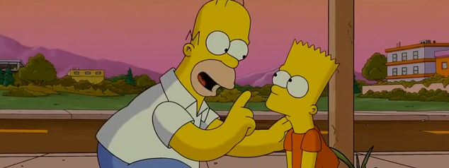

<div align="center">



# Sofar
Sofa Reader and Renderer

</div>

## Features
This crate provides high level bindings to [`libmysofa`] API allows to read
`HRTF` filters from `SOFA` files (Spatially Oriented Format for Acoustics).

The [`render`] module implements uniformly partitioned convolution algorithm
for rendering HRTF filters.

[`libmysofa`]: https://github.com/hoene/libmysofa
[`render`]: `crate::render`

## Example

```rust

use sofar::reader::{OpenOptions, Filter};
use sofar::render::Renderer;

// Open sofa file, resample HRTF data if needed to 44_100
let sofa = OpenOptions::new()
    .sample_rate(44100.0)
    .open("my/sofa/file.sofa")
    .unwrap();

let filt_len = sofa.filter_len();
let mut filter = Filter::new(filt_len);

// Get filter at poistion
sofa.filter(0.0, 1.0, 0.0, &mut filter);

let mut render = Renderer::builder(filt_len)
    .with_sample_rate(44100.0)
    .with_partition_len(64)
    .build()
    .unwrap();

render.set_filter(&filter);

let input = vec![0.0; 256];
let mut left = vec![0.0; 256];
let mut right = vec![0.0; 256];

// read_input()

render.process_block(&input, &mut left, &mut right).unwrap();
```

You can run `cpal` renderer example like this:

``` shell
cargo run --example renderer -- <FILENAME-MONO.wav> libmysofa-sys/libmysofa/share/default.sofa

```

# License

This project is licensed under either of

 * Apache License, Version 2.0, ([LICENSE-APACHE](LICENSE-APACHE) or
   http://www.apache.org/licenses/LICENSE-2.0)
 * MIT license ([LICENSE-MIT](LICENSE-MIT) or
   http://opensource.org/licenses/MIT)

at your option.
