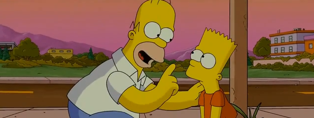

<div align="center">



# Sofar
Pure Rust SOFA Reader and HRTF Renderer

</div>

## Features
A pure Rust implementation for reading `HRTF` filters from `SOFA` files
(Spatially Oriented Format for Acoustics).

The [`render`] module implements uniformly partitioned convolution algorithm
for rendering HRTF filters.

Based on the [`libmysofa`] C library by Christian Hoene / Symonics GmbH.

[`libmysofa`]: https://github.com/hoene/libmysofa
[`render`]: `crate::render`

## Example

```rust

use sofar::reader::{OpenOptions, Filter};
use sofar::render::Renderer;

// Open sofa file, resample HRTF data if needed to 44_100
let sofa = OpenOptions::new()
    .sample_rate(44100.0)
    .open("my/sofa/file.sofa")
    .unwrap();

let filt_len = sofa.filter_len();
let mut filter = Filter::new(filt_len);

// Get filter at position
sofa.filter(0.0, 1.0, 0.0, &mut filter);

let mut render = Renderer::builder(filt_len)
    .with_sample_rate(44100.0)
    .with_partition_len(64)
    .build()
    .unwrap();

render.set_filter(&filter).unwrap();

let input = vec![0.0; 256];
let mut left = vec![0.0; 256];
let mut right = vec![0.0; 256];

// read_input()

render.process_block(&input, &mut left, &mut right).unwrap();
```

You can run `cpal` renderer example like this:

``` shell
cargo run --example renderer -- <FILENAME-MONO.wav> libmysofa-sys/libmysofa/share/default.sofa
```

## Acknowledgments

This project is a Rust port of [libmysofa](https://github.com/hoene/libmysofa),
a C library for reading SOFA files.

- **libmysofa** Copyright © 2016-2017 Symonics GmbH, Christian Hoene (BSD-3-Clause)
- **KD-tree** Copyright © 2007-2011 John Tsiombikas (BSD-3-Clause)

See the [NOTICE](NOTICE) file for full attribution details.

# License

This project is licensed under either of

 * Apache License, Version 2.0, ([LICENSE-APACHE](LICENSE-APACHE) or
   http://www.apache.org/licenses/LICENSE-2.0)
 * MIT license ([LICENSE-MIT](LICENSE-MIT) or
   http://opensource.org/licenses/MIT)

at your option.
